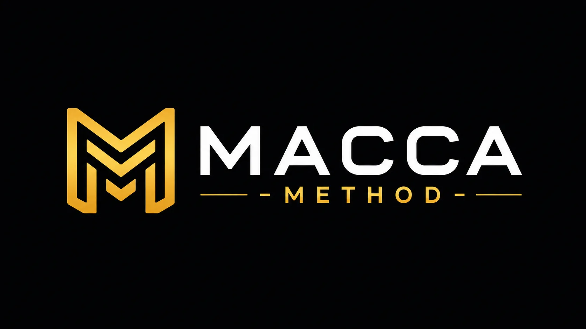

# MACCA - METHOD

**MACCA** adalah sistem pengembangan perangkat lunak berbasis AI yang bekerja dari **spesifikasi tertulis**, bukan tebakan. Sebelum ada satu baris kode pun, semua keputusan penting sudah didokumentasikan. AI bekerja sesuai dokumen itu — bukan asumsi.

> **Macca** berasal dari bahasa Bugis yang berarti *pintar, cerdas, pandai*. Dalam falsafah Bugis-Makassar, kepintaran selalu disandingkan dengan sifat-sifat luhur — identitas moral yang dibawa ke mana saja.



---

## Daftar Isi

1. [Masalah yang Diselesaikan](#1-masalah-yang-diselesaikan)
2. [Cara Kerja](#2-cara-kerja)
3. [Glosarium Istilah](#3-glosarium-istilah)
4. [Daftar Skill](#4-daftar-skill)
5. [Workflow: Project Baru](#5-workflow-project-baru)
6. [Workflow: Project yang Sudah Berjalan / Boilerplate](#6-workflow-project-yang-sudah-berjalan--boilerplate)
7. [Workflow: Menambah Fitur Baru](#7-workflow-menambah-fitur-baru)
8. [Workflow: Memperbaiki Bug](#8-workflow-memperbaiki-bug)
9. [Instalasi & Cara Menggunakan](#9-instalasi--cara-menggunakan)
10. [Struktur Folder](#10-struktur-folder)

---

## 1. Masalah yang Diselesaikan

Ketika menggunakan AI untuk coding tanpa panduan yang jelas, sering terjadi:

- AI membuat kode yang tidak sesuai dengan kebutuhan bisnis
- Setiap sesi AI seolah "lupa" konteks project sebelumnya
- Tidak ada standar kode — setiap file ditulis dengan gaya berbeda
- Sulit tahu kapan fitur benar-benar selesai
- Bug yang sama muncul berulang kali

**MACCA menyelesaikan ini** dengan cara: semua keputusan (fitur, database, API, tampilan, standar kode) ditulis dalam dokumen spec terlebih dahulu. AI membaca dokumen itu sebelum coding, dan memverifikasi hasilnya setelah coding.

---

## 2. Cara Kerja

MACCA menggunakan **skill** — instruksi terstruktur yang diberikan ke AI untuk menjalankan tugas spesifik. Setiap skill punya tanggung jawab yang jelas dan tidak tumpang tindih.

```
┌─────────────────────────────────────────────────────┐
│                    FASE PERENCANAAN                  │
│                                                     │
│  brainstorm-prd → brainstorm-architecture           │
│       ↓                    ↓                        │
│  brainstorm-styleguide  brainstorm-schema           │
│                             ↓                       │
│                         brainstorm-api              │
│                             ↓                       │
│                         brainstorm-rules            │
│                             ↓                       │
│                         brainstorm-task             │
└─────────────────────────────────────────────────────┘
                          ↓
┌─────────────────────────────────────────────────────┐
│                    FASE EKSEKUSI                     │
│                                                     │
│            developer (per fase Task.md)             │
│                ↓ (setelah tiap fase)                │
│         spec-compliance → code-review               │
└─────────────────────────────────────────────────────┘
```

Semua dokumen hasil perencanaan disimpan di folder `project-context/` di dalam project kamu.

---

## 3. Glosarium Istilah

| Istilah | Penjelasan Sederhana |
|---|---|
| **Skill** | Instruksi lengkap untuk AI agar melakukan tugas tertentu. Seperti "SOP" untuk AI. |
| **Spec** / **Dokumen Spec** | Dokumen perencanaan project — berisi semua keputusan sebelum coding dimulai. |
| **project-context/** | Folder tempat semua dokumen spec disimpan, di dalam project kamu. |
| **PRD.md** | *Product Requirements Document* — daftar fitur, aturan bisnis, dan kriteria selesai. |
| **architecture.md** | Keputusan teknis: bahasa pemrograman, framework, struktur folder, pola desain. |
| **schema.md** | Desain database: tabel apa yang ada, kolom-kolomnya, dan relasinya. |
| **api.md** | Daftar endpoint API: URL, method (GET/POST/dll), format request dan response. |
| **rules.md** | Standar penulisan kode: penamaan variabel, format, dan aturan yang tidak boleh dilanggar. Mengandung seksi `[FORBIDDEN]` — daftar larangan teknis yang wajib dipindai AI sebelum menulis kode. |
| **StyleGuide.md** | Panduan tampilan: warna, font, komponen UI, framework CSS yang digunakan. |
| **Task.md** | Rencana kerja bertahap: daftar semua tugas yang harus dikerjakan, dikelompokkan per fase. |
| **Fase** | Kelompok task yang saling berkaitan, diselesaikan bersama. Contoh: "Fase 1: Setup Database". |
| **Task** | Satuan pekerjaan terkecil yang bisa diselesaikan dalam satu sesi. |
| **Acceptance Criteria** | Kondisi yang harus terpenuhi agar sebuah task dianggap selesai. Bisa dicek secara konkret. |
| **Boilerplate** | Template atau starter code project yang sudah ada sebelum mulai coding dari nol. |
| **spec-compliance** | Verifikasi bahwa kode sudah sesuai dengan dokumen spec. |
| **code-review** | Pemeriksaan kualitas dan keamanan kode — bukan soal spec, tapi soal kualitas penulisan. |
| **bug-log.md** | Catatan semua bug yang pernah ditemukan dan diperbaiki — supaya AI belajar dari sejarah. |
| **[FORBIDDEN]** | Seksi di `rules.md` berisi daftar larangan teknis (hardcode, `any`, console.log, dll). AI memindainya sebelum menulis kode. |
| **[SELF-REVIEW]** | Output singkat dari `developer` setelah tiap task selesai: 1 potensi security risk, 1 performance bottleneck, 1 asumsi yang dibuat dari spec. |

---

## 4. Daftar Skill

### Skill Perencanaan (Brainstorm)

| Skill | Persona | Fungsi | Kapan Digunakan |
|---|---|---|---|
| `brainstorm-prd` | @Galbi | Membuat PRD.md melalui sesi wawancara interaktif | Pertama kali, saat memulai project baru |
| `brainstorm-architecture` | @Fachri | Membuat architecture.md — keputusan tech stack dan struktur | Setelah PRD selesai (**wajib sebelum schema & api**) |
| `brainstorm-schema` | @Fachri | Membuat schema.md — desain database | Setelah architecture selesai |
| `brainstorm-api` | @Fachri | Membuat api.md — kontrak endpoint API | Setelah schema selesai |
| `brainstorm-rules` | @Fachri | Membuat rules.md — standar kode dan daftar larangan `[FORBIDDEN]` | Kapan saja, tapi sebelum coding dimulai |
| `brainstorm-styleguide` | @Akram | Membuat StyleGuide.md — panduan UI/UX | Setelah PRD selesai, jika project punya UI |
| `brainstorm-task` | @Galbi | Membuat Task.md — rencana kerja bertahap dengan urutan TDD (task test sebelum task implementasi) | Setelah semua spec di atas selesai |

### Skill Eksekusi

| Skill | Persona | Fungsi | Kapan Digunakan |
|---|---|---|---|
| `developer` | @Firdaus | Mengerjakan task dari Task.md dengan pendekatan TDD — test ditulis sebelum implementasi, dilengkapi `[SELF-REVIEW]` setelah tiap task | Setelah Task.md ada dan siap dikerjakan |
| `spec-compliance` | @Fachri | Verifikasi kode terhadap semua dokumen spec | Otomatis setelah setiap fase di developer |
| `code-review` | @Fachri | Cek kualitas dan keamanan kode (27 item) | Setelah spec-compliance bersih |

### Skill Utilitas

| Skill | Persona | Fungsi | Kapan Digunakan |
|---|---|---|---|
| `help` | @Galbi | Deteksi kondisi project & rekomendasikan langkah berikutnya | Kapan saja, terutama jika bingung harus mulai dari mana |
| `bug-fix` | @Ikhsan | Diagnosis, perbaikan, dan dokumentasi bug | Saat ada bug yang perlu diperbaiki |
| `add-feature` | @Galbi | Tambah fitur baru ke project yang sudah berjalan | Setelah project berjalan dan ada fitur baru |
| `spec-audit` | @Fachri | Cek konsistensi antar semua dokumen spec | Setelah beberapa/semua spec selesai, sebelum coding |
| `spec-init` | @Fachri | Buat semua spec dari codebase yang sudah ada | Untuk project yang sudah berjalan tapi belum punya spec |
| `rapat` | @Galbi | Diskusi tim multi-persona dalam satu sesi | Kapan saja, saat butuh perspektif dari beberapa keahlian sekaligus |

### Tim AI MACCA

Setiap skill dijalankan oleh satu **persona** — karakter AI dengan keahlian spesifik. Kamu bisa memanggil mereka by name selama sesi.

| Persona | Role | Skills |
|---|---|---|
| **@Galbi** | Project Manager | `brainstorm-prd`, `brainstorm-task`, `add-feature`, `help`, `rapat` |
| **@Fachri** | Tech Lead | `brainstorm-architecture`, `brainstorm-api`, `brainstorm-schema`, `brainstorm-rules`, `spec-init`, `spec-audit`, `spec-compliance`, `code-review` |
| **@Akram** | UI/UX Designer | `brainstorm-styleguide` |
| **@Firdaus** | Expert Developer | `developer` |
| **@Ikhsan** | Debugger | `bug-fix` |

---

## 5. Workflow: Project Baru

Gunakan alur ini jika kamu memulai project dari nol.

```
Langkah 1: Mulai dari ide
  → Panggil: brainstorm-prd
  → Hasil: project-context/PRD.md

Langkah 2: Definisikan arsitektur
  → Panggil: brainstorm-architecture   ← WAJIB sebelum lanjut
  → Hasil: project-context/architecture.md

Langkah 3a: Desain database (jika ada)
  → Panggil: brainstorm-schema
  → Hasil: project-context/schema.md

Langkah 3b: Definisikan API (jika ada)
  → Panggil: brainstorm-api            ← harus setelah schema
  → Hasil: project-context/api.md

Langkah 3c: Definisikan tampilan (jika ada UI)
  → Panggil: brainstorm-styleguide
  → Hasil: project-context/StyleGuide.md

Langkah 4: Tetapkan standar kode
  → Panggil: brainstorm-rules
  → Hasil: project-context/rules.md

Langkah 5: Cek konsistensi (opsional tapi disarankan)
  → Panggil: spec-audit
  → Hasil: Laporan konflik antar dokumen

Langkah 6: Buat rencana kerja
  → Panggil: brainstorm-task
  → Hasil: project-context/Task.md

Langkah 7: Mulai coding
  → Panggil: developer
  → Per fase: kode → spec-compliance → code-review → fase berikutnya
  → Hingga: semua task selesai
```

> **Tips:** Jika bingung harus mulai dari mana, panggil `help` — skill ini akan mendeteksi kondisi project kamu dan merekomendasikan langkah berikutnya.

---

## 6. Workflow: Project yang Sudah Berjalan / Boilerplate

Gunakan alur ini jika kamu punya codebase yang sudah ada tapi belum punya dokumen spec.

```
Langkah 1: Generate spec dari codebase yang ada
  → Panggil: spec-init
  → AI akan baca codebase kamu dan generate semua dokumen spec secara otomatis.
  
  Ada dua mode:
  ┌─────────────────────────────────────────────────────┐
  │ Mode Batch    : Semua dokumen dibuat sekaligus.     │
  │                Cocok untuk project kecil.           │
  │                                                     │
  │ Mode Terpandu : Satu dokumen dibuat, kamu review,   │
  │                 konfirmasi, lalu lanjut ke berikutnya│
  │                Cocok untuk project besar.           │
  └─────────────────────────────────────────────────────┘
  
  Urutan generate (otomatis):
  architecture.md → rules.md → schema.md → api.md → StyleGuide.md → PRD.md
  
  Catatan: PRD dibuat terakhir karena isinya disimpulkan dari kode yang ada,
  bukan dari asumsi.

Langkah 2: Review & koreksi dokumen spec
  → Baca setiap file di project-context/ dan pastikan isinya akurat.
  → Koreksi jika ada yang tidak sesuai dengan kenyataan project.

Langkah 3: Cek konsistensi
  → Panggil: spec-audit
  → Pastikan tidak ada konflik antar dokumen.

Langkah 4: Buat rencana kerja untuk fitur-fitur baru
  → Panggil: brainstorm-task
  → Hasil: project-context/Task.md

Langkah 5: Lanjut seperti biasa
  → Panggil: developer untuk mulai mengerjakan task.
```

---

## 7. Workflow: Menambah Fitur Baru

Gunakan alur ini ketika semua task sudah selesai tapi ada fitur baru yang ingin ditambahkan.

```
→ Panggil: add-feature

Apa yang terjadi:
  1. AI membaca semua spec yang ada
  2. Kamu mendeskripsikan fitur baru
  3. AI mengidentifikasi dokumen mana yang perlu diupdate
  4. AI mengupdate SEMUA dokumen yang terdampak (wajib, tidak ada yang dilewati)
  5. AI memanggil brainstorm-task untuk menambahkan fase dan task baru
  6. Kamu melanjutkan dengan developer seperti biasa
```

---

## 8. Workflow: Memperbaiki Bug

Gunakan alur ini ketika ada bug yang perlu diperbaiki.

```
→ Panggil: bug-fix

Apa yang terjadi:
  1. Kamu mendeskripsikan bug (gejala, lokasi, cara reproduksi)
  2. AI cek bug-log.md — apakah bug ini pernah terjadi sebelumnya?
     - Jika identik dengan bug lama → terapkan fix yang sama
     - Jika mirip tapi berbeda → diagnosis ulang, tambah log baru
     - Jika baru → diagnosis dari awal
  3. AI merumuskan root cause (penyebab utama) dan menjelaskan ke kamu
  4. Kamu konfirmasi sebelum fix diterapkan
  5. Fix diterapkan, lalu spec-compliance + code-review dijalankan
  6. Kamu konfirmasi bahwa bug sudah teratasi
  7. AI mencatat bug + solusi ke project-context/bug-log.md
     (baru dicatat setelah kamu konfirmasi — tidak otomatis)
```

---

## 9. Instalasi & Cara Menggunakan

**Prasyarat:** GitHub Copilot aktif di VS Code.

### Instalasi

Masuk ke folder project kamu, lalu jalankan **satu perintah** berikut:

**Linux / Mac**

```bash
curl -fsSL https://raw.githubusercontent.com/firdaus12p/macca-workflow/main/install.sh | bash
```

**Windows (PowerShell)**

```powershell
irm https://raw.githubusercontent.com/firdaus12p/macca-workflow/main/install.ps1 | iex
```

Installer akan menampilkan menu pilihan AI tool:

```
  Pilih AI tool yang kamu gunakan:
  (ketik nomor, pisahkan spasi — contoh: 1 3 4)
  (ketik 0 untuk pilih semua)

  [1] GitHub Copilot       → .github/skills/
  [2] Cursor               → .claude/skills/  (Claude Code compatible)
  [3] Claude Code          → .claude/skills/
  [4] Windsurf             → .windsurf/skills/
  [5] Gemini CLI           → .gemini/skills/
  [6] OpenCode             → .opencode/skill/
  [7] Kilo Code            → .kilo/skills/
  [8] Codex (OpenAI)       → .agents/skills/  (sudah ada)
  [9] Kimi CLI             → ~/.config/agents/skills/
```

Kamu bisa memilih lebih dari satu tool (contoh: `1 3` untuk Copilot + Claude). Ketik `0` untuk install semua sekaligus. Installer juga menanyakan nama developer (opsional).

### Update ke Versi Terbaru

Dari dalam folder project kamu:

**Linux / Mac**

```bash
curl -fsSL https://raw.githubusercontent.com/firdaus12p/macca-workflow/main/upgrade.sh | bash
```

**Windows (PowerShell)**

```powershell
irm https://raw.githubusercontent.com/firdaus12p/macca-workflow/main/upgrade.ps1 | iex
```

> `project-context/` dan `developer-config.json` kamu **tidak akan tersentuh** saat upgrade. Skills di semua folder tool **diperbarui otomatis** sesuai pilihan saat install.

### Cara Memanggil Skill

Ketik nama skill di chat tool AI kamu. Semua tool yang didukung mengenali skill secara native. Contoh:

```
Gunakan skill brainstorm-prd untuk mulai project baru saya.
```

```
Gunakan skill developer
```

Atau panggil `help` untuk panduan interaktif:

```
Gunakan skill help
```

---

## 10. Struktur Folder

```
your-project/
├── .agents/
│   ├── skills/                  ← master skills (Codex native + source untuk semua tools)
│   │   ├── brainstorm-prd/SKILL.md
│   │   ├── brainstorm-architecture/SKILL.md
│   │   ├── brainstorm-schema/SKILL.md
│   │   ├── brainstorm-api/SKILL.md
│   │   ├── brainstorm-rules/SKILL.md
│   │   ├── brainstorm-styleguide/SKILL.md
│   │   ├── brainstorm-task/SKILL.md
│   │   ├── spec-compliance/SKILL.md
│   │   ├── code-review/SKILL.md
│   │   ├── developer/SKILL.md
│   │   ├── help/SKILL.md
│   │   ├── bug-fix/SKILL.md
│   │   ├── add-feature/SKILL.md
│   │   ├── spec-audit/SKILL.md
│   │   └── spec-init/SKILL.md
│   ├── developer-config.json    ← nama developer (opsional)
│   └── macca-tools.txt          ← tools yang dipilih saat install
│
├── (dibuat otomatis sesuai tool yang dipilih saat install)
│   ├── .github/skills/          ← GitHub Copilot
│   ├── .claude/skills/          ← Claude Code + Cursor
│   ├── .windsurf/skills/        ← Windsurf
│   ├── .gemini/skills/          ← Gemini CLI
│   ├── .opencode/skill/         ← OpenCode
│   ├── .kilo/skills/            ← Kilo Code
│   └── ~/.config/agents/skills/ ← Kimi CLI (global user-level)
│
├── project-context/             ← dibuat otomatis oleh skill
│   ├── PRD.md
│   ├── architecture.md
│   ├── schema.md
│   ├── api.md
│   ├── rules.md
│   ├── StyleGuide.md
│   ├── Task.md
│   ├── bug-log.md               ← dibuat otomatis saat ada bug pertama
│   └── plans/                   ← rencana kerja per fase (opsional)
│       └── fase-1-setup-database.md
│
├── skills-lock.json
└── ... (kode project kamu)
```

---

## Pertanyaan Umum

**Q: Harus isi semua dokumen spec dulu sebelum coding?**

Tidak harus sempurna. Minimal yang harus ada sebelum `developer` bisa jalan: `PRD.md`, `architecture.md`. Semakin lengkap spec, semakin akurat AI bekerja — tapi tidak harus sempurna di awal.

**Q: Apakah bisa dipakai untuk project yang sudah berjalan?**

Bisa. Gunakan skill `spec-init` — AI akan membaca kodebase yang ada dan menghasilkan semua dokumen spec secara otomatis.

**Q: Apakah AI bisa membuat kesalahan?**

Bisa. Itulah kenapa ada `spec-compliance` (cek kode vs spec) dan `code-review` (cek kualitas kode) yang dijalankan otomatis setelah setiap fase selesai. Jika ada yang tidak sesuai, AI memperbaikinya sebelum lanjut.

**Q: Bagaimana jika saya tidak mengerti istilah teknis?**

Skill `developer` dirancang untuk menjelaskan keputusan teknis menggunakan **analogi** dari kehidupan sehari-hari. Jika ada yang tidak jelas, AI akan berhenti dan bertanya sebelum melanjutkan.

**Q: Apakah bug-log otomatis diupdate?**

Tidak. Bug hanya dicatat setelah **kamu mengonfirmasi** bahwa bug sudah benar-benar teratasi. AI tidak akan mencatat ke bug-log tanpa izin kamu.

---

**Q: Kenapa developer menulis test sebelum kode implementasi?**

Ini adalah pendekatan TDD (Test-Driven Development). Dengan menulis test dulu, AI dipaksa mendefinisikan signature dan perilaku fungsi secara pasti sebelum implementasi dimulai — mencegah perubahan struktur di tengah jalan. Kamu akan melihat task test (`Task N.1`) selalu hadir sebelum task implementasi (`Task N.2`) di Task.md.

---

**Q: Apa itu `[SELF-REVIEW]` yang muncul setelah developer coding?**

Setelah setiap task selesai, developer menulis refleksi singkat: 1 potensi security risk, 1 potensi performance bottleneck, dan 1 asumsi yang dibuat dari spec. Tujuannya adalah mengekspos tebakan tersembunyi sebelum masuk ke fase verifikasi (`spec-compliance` + `code-review`).

---

## Lisensi

MIT License — bebas digunakan, dimodifikasi, dan didistribusikan.
